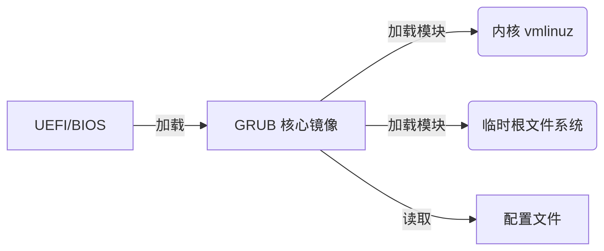
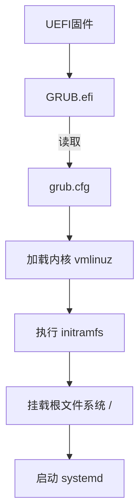

**GRUB（GRand Unified Bootloader）** 是 Linux 系统的**核心引导加载器**，负责在操作系统启动前加载内核并管理多系统启动。以下是其深度解析：

------

### **一、GRUB 的核心作用**

1. **硬件初始化**：
   接管 BIOS/UEFI 的硬件控制权，初始化内存、磁盘等基础设备。
2. **内核加载**：
   定位并加载 Linux 内核文件（`vmlinuz`）和临时根文件系统（`initramfs`）。
3. **启动菜单管理**：
   提供交互式菜单，支持**多操作系统选择**（如 Windows 与 Linux 共存）或**不同内核版本切换**。
4. **启动参数传递**：
   向内核传递关键参数（如根分区路径 `root=/dev/sda2`、恢复模式 `single`）。

> 💡 比喻：GRUB 如同机场塔台，指挥操作系统“航班”从硬件“跑道”上正确起飞。

------

### **二、GRUB 的版本演进**

| **版本**        | 特点                                                         | 适用场景                     |
| :-------------- | :----------------------------------------------------------- | :--------------------------- |
| **GRUB Legacy** | 传统版本（1995~），配置文件为 `menu.lst`，功能有限           | 旧系统（如 RHEL 6）          |
| **GRUB 2**      | 现代版本（2005~），模块化设计，支持脚本、主题、加密，配置文件为 `grub.cfg` | 主流发行版（Ubuntu/RHEL 8+） |

------

### **三、GRUB 2 的核心架构**

Diagram



<svg role="graphics-document document" viewBox="-13.9 -13.9 695.5999877929687 305.79999999999995" class="flowchart mermaid-svg" xmlns="http://www.w3.org/2000/svg" width="100%" id="mermaid-svg-19" height="100%" style="max-width: 100%; transform-origin: 0px 0px; user-select: none; transform: translate(0px, 2.85651px) scale(1);"><g><marker orient="auto" markerHeight="8" markerWidth="8" markerUnits="userSpaceOnUse" refY="5" refX="5" viewBox="0 0 10 10" class="marker flowchart-v2" id="mermaid-svg-19_flowchart-v2-pointEnd"><path style="stroke-width: 1; stroke-dasharray: 1, 0;" class="arrowMarkerPath" d="M 0 0 L 10 5 L 0 10 z"></path></marker><marker orient="auto" markerHeight="8" markerWidth="8" markerUnits="userSpaceOnUse" refY="5" refX="4.5" viewBox="0 0 10 10" class="marker flowchart-v2" id="mermaid-svg-19_flowchart-v2-pointStart"><path style="stroke-width: 1; stroke-dasharray: 1, 0;" class="arrowMarkerPath" d="M 0 5 L 10 10 L 10 0 z"></path></marker><marker orient="auto" markerHeight="11" markerWidth="11" markerUnits="userSpaceOnUse" refY="5" refX="11" viewBox="0 0 10 10" class="marker flowchart-v2" id="mermaid-svg-19_flowchart-v2-circleEnd"><circle style="stroke-width: 1; stroke-dasharray: 1, 0;" class="arrowMarkerPath" r="5" cy="5" cx="5"></circle></marker><marker orient="auto" markerHeight="11" markerWidth="11" markerUnits="userSpaceOnUse" refY="5" refX="-1" viewBox="0 0 10 10" class="marker flowchart-v2" id="mermaid-svg-19_flowchart-v2-circleStart"><circle style="stroke-width: 1; stroke-dasharray: 1, 0;" class="arrowMarkerPath" r="5" cy="5" cx="5"></circle></marker><marker orient="auto" markerHeight="11" markerWidth="11" markerUnits="userSpaceOnUse" refY="5.2" refX="12" viewBox="0 0 11 11" class="marker cross flowchart-v2" id="mermaid-svg-19_flowchart-v2-crossEnd"><path style="stroke-width: 2; stroke-dasharray: 1, 0;" class="arrowMarkerPath" d="M 1,1 l 9,9 M 10,1 l -9,9"></path></marker><marker orient="auto" markerHeight="11" markerWidth="11" markerUnits="userSpaceOnUse" refY="5.2" refX="-1" viewBox="0 0 11 11" class="marker cross flowchart-v2" id="mermaid-svg-19_flowchart-v2-crossStart"><path style="stroke-width: 2; stroke-dasharray: 1, 0;" class="arrowMarkerPath" d="M 1,1 l 9,9 M 10,1 l -9,9"></path></marker><g class="root"><g class="clusters"></g><g class="edgePaths"><path marker-end="url(#mermaid-svg-19_flowchart-v2-pointEnd)" style="" class="edge-thickness-normal edge-pattern-solid edge-thickness-normal edge-pattern-solid flowchart-link" id="L_UEFI/BIOS_core.img_0" d="M147.125,139L153.958,139C160.792,139,174.458,139,187.458,139C200.458,139,212.792,139,218.958,139L225.125,139"></path><path marker-end="url(#mermaid-svg-19_flowchart-v2-pointEnd)" style="" class="edge-thickness-normal edge-pattern-solid edge-thickness-normal edge-pattern-solid flowchart-link" id="L_core.img_kernel_0" d="M353.935,112L371.746,99.167C389.556,86.333,425.178,60.667,453.599,47.833C482.019,35,503.238,35,513.847,35L524.456,35"></path><path marker-end="url(#mermaid-svg-19_flowchart-v2-pointEnd)" style="" class="edge-thickness-normal edge-pattern-solid edge-thickness-normal edge-pattern-solid flowchart-link" id="L_core.img_initramfs_0" d="M403.8,139L413.3,139C422.8,139,441.8,139,460.133,139C478.467,139,496.133,139,504.967,139L513.8,139"></path><path marker-end="url(#mermaid-svg-19_flowchart-v2-pointEnd)" style="" class="edge-thickness-normal edge-pattern-solid edge-thickness-normal edge-pattern-solid flowchart-link" id="L_core.img_grub.cfg_0" d="M353.935,166L371.746,178.833C389.556,191.667,425.178,217.333,453.322,230.167C481.467,243,502.133,243,512.467,243L522.8,243"></path></g><g class="edgeLabels"><g transform="translate(188.125, 139)" class="edgeLabel"><g transform="translate(-16, -12)" class="label"><foreignObject height="24" width="32"><div class="labelBkg" xmlns="http://www.w3.org/1999/xhtml" style="background-color: rgba(232, 232, 232, 0.5); display: table-cell; white-space: nowrap; line-height: 1.5; max-width: 200px; text-align: center;"><span class="edgeLabel" style="fill: rgb(51, 51, 51); color: rgb(51, 51, 51); background-color: rgba(232, 232, 232, 0.8); text-align: center;"><p style="margin: 0px; background-color: rgba(232, 232, 232, 0.8);">加载</p></span></div></foreignObject></g></g><g transform="translate(460.8000030517578, 35)" class="edgeLabel"><g transform="translate(-32, -12)" class="label"><foreignObject height="24" width="64"><div class="labelBkg" xmlns="http://www.w3.org/1999/xhtml" style="background-color: rgba(232, 232, 232, 0.5); display: table-cell; white-space: nowrap; line-height: 1.5; max-width: 200px; text-align: center;"><span class="edgeLabel" style="fill: rgb(51, 51, 51); color: rgb(51, 51, 51); background-color: rgba(232, 232, 232, 0.8); text-align: center;"><p style="margin: 0px; background-color: rgba(232, 232, 232, 0.8);">加载模块</p></span></div></foreignObject></g></g><g transform="translate(460.8000030517578, 139)" class="edgeLabel"><g transform="translate(-32, -12)" class="label"><foreignObject height="24" width="64"><div class="labelBkg" xmlns="http://www.w3.org/1999/xhtml" style="background-color: rgba(232, 232, 232, 0.5); display: table-cell; white-space: nowrap; line-height: 1.5; max-width: 200px; text-align: center;"><span class="edgeLabel" style="fill: rgb(51, 51, 51); color: rgb(51, 51, 51); background-color: rgba(232, 232, 232, 0.8); text-align: center;"><p style="margin: 0px; background-color: rgba(232, 232, 232, 0.8);">加载模块</p></span></div></foreignObject></g></g><g transform="translate(460.8000030517578, 243)" class="edgeLabel"><g transform="translate(-16, -12)" class="label"><foreignObject height="24" width="32"><div class="labelBkg" xmlns="http://www.w3.org/1999/xhtml" style="background-color: rgba(232, 232, 232, 0.5); display: table-cell; white-space: nowrap; line-height: 1.5; max-width: 200px; text-align: center;"><span class="edgeLabel" style="fill: rgb(51, 51, 51); color: rgb(51, 51, 51); background-color: rgba(232, 232, 232, 0.8); text-align: center;"><p style="margin: 0px; background-color: rgba(232, 232, 232, 0.8);">读取</p></span></div></foreignObject></g></g></g><g class="nodes"><g transform="translate(77.5625, 139)" id="flowchart-UEFI/BIOS-0" class="node default"><rect height="54" width="139.125" y="-27" x="-69.5625" style="" class="basic label-container"></rect><g transform="translate(-39.5625, -12)" style="" class="label"><rect></rect><foreignObject height="24" width="79.125"><div xmlns="http://www.w3.org/1999/xhtml" style="display: table-cell; white-space: nowrap; line-height: 1.5; max-width: 200px; text-align: center;"><span class="nodeLabel" style="fill: rgb(51, 51, 51); color: rgb(51, 51, 51);"><p style="margin: 0px;">UEFI/BIOS</p></span></div></foreignObject></g></g><g transform="translate(316.4625015258789, 139)" id="flowchart-core.img-1" class="node default"><rect height="54" width="174.6750030517578" y="-27" x="-87.3375015258789" style="" class="basic label-container"></rect><g transform="translate(-57.337501525878906, -12)" style="" class="label"><rect></rect><foreignObject height="24" width="114.67500305175781"><div xmlns="http://www.w3.org/1999/xhtml" style="display: table-cell; white-space: nowrap; line-height: 1.5; max-width: 200px; text-align: center;"><span class="nodeLabel" style="fill: rgb(51, 51, 51); color: rgb(51, 51, 51);"><p style="margin: 0px;">GRUB 核心镜像</p></span></div></foreignObject></g></g><g transform="translate(588.8000030517578, 35)" id="flowchart-kernel-3" class="node default"><rect height="54" width="120.6875" y="-27" x="-60.34375" ry="5" rx="5" style="" class="basic label-container"></rect><g transform="translate(-45.34375, -12)" style="" class="label"><rect></rect><foreignObject height="24" width="90.6875"><div xmlns="http://www.w3.org/1999/xhtml" style="display: table-cell; white-space: nowrap; line-height: 1.5; max-width: 200px; text-align: center;"><span class="nodeLabel" style="fill: rgb(51, 51, 51); color: rgb(51, 51, 51);"><p style="margin: 0px;">内核 vmlinuz</p></span></div></foreignObject></g></g><g transform="translate(588.8000030517578, 139)" id="flowchart-initramfs-5" class="node default"><rect height="54" width="142" y="-27" x="-71" ry="5" rx="5" style="" class="basic label-container"></rect><g transform="translate(-56, -12)" style="" class="label"><rect></rect><foreignObject height="24" width="112"><div xmlns="http://www.w3.org/1999/xhtml" style="display: table-cell; white-space: nowrap; line-height: 1.5; max-width: 200px; text-align: center;"><span class="nodeLabel" style="fill: rgb(51, 51, 51); color: rgb(51, 51, 51);"><p style="margin: 0px;">临时根文件系统</p></span></div></foreignObject></g></g><g transform="translate(588.8000030517578, 243)" id="flowchart-grub.cfg-7" class="node default"><rect height="54" width="124" y="-27" x="-62" style="" class="basic label-container"></rect><g transform="translate(-32, -12)" style="" class="label"><rect></rect><foreignObject height="24" width="64"><div xmlns="http://www.w3.org/1999/xhtml" style="display: table-cell; white-space: nowrap; line-height: 1.5; max-width: 200px; text-align: center;"><span class="nodeLabel" style="fill: rgb(51, 51, 51); color: rgb(51, 51, 51);"><p style="margin: 0px;">配置文件</p></span></div></foreignObject></g></g></g></g></g></svg>

1. **核心镜像 (`core.img`)**
   - 嵌入在磁盘 **MBR 或 GPT 保留扇区**，大小约 20-60 KB。
   - 包含基础驱动（如磁盘访问、文件系统识别）。
2. **动态模块**
   - 按需加载功能模块（如 `ext4.mod`、`lvm.mod`），减少核心镜像体积。
3. **配置文件 (`grub.cfg`)**
   - 位于 `/boot/grub/grub.cfg`（**禁止手动编辑**！由工具生成）。
   - 定义启动菜单、内核参数、主题等。

------

### **四、GRUB 2 的关键流程（以 UEFI 系统为例）**

1. **固件阶段**
   UEFI 从 ESP 分区加载 `EFI/ubuntu/grubx64.efi`（GRUB 2 的 UEFI 应用）。
2. **GRUB 初始化**
   - 加载核心模块，识别磁盘和文件系统。
   - 读取 `/boot/grub/grub.cfg` 配置。
3. **菜单交互**
   显示启动选项（默认等待 5 秒），用户可选择内核或进入命令行。
4. **内核加载**
   根据配置加载 `/boot/vmlinuz-xxx` 和 `/boot/initramfs-xxx.img`。
5. **控制权移交**
   内核接管硬件，执行 `initramfs` 中的脚本（如解锁 LUKS 加密），最后挂载根文件系统。

------

### **五、GRUB 2 的核心功能**

1. **多系统引导**

   - 通过 `os-prober` 自动检测 Windows、macOS 等系统，生成启动项。

   ```
   menuentry 'Windows 11' {
     insmod ntfs
     set root=(hd0,gpt1)
     chainloader /EFI/Microsoft/Boot/bootmgfw.efi
   }
   ```

2. **救援与修复**

   - 按 `C` 进入命令行，手动加载内核（如分区损坏时）：

     grub

     ```
     grub> ls (hd0,gpt2)/boot  # 列出文件
     grub> linux /boot/vmlinuz-5.15.0-xxx root=/dev/nvme0n1p3
     grub> initrd /boot/initramfs-5.15.0-xxx.img
     grub> boot
     ```

3. **安全支持**

   - 配合 **Secure Boot** 使用签名过的 `shim.efi` → `grubx64.efi` 链。

4. **高级特性**

   - 加密启动菜单密码
   - 主题定制（背景图、字体）
   - 脚本自动化（如预启动硬件检测）

------

### **六、GRUB 2 的配置与管理**

#### ▶ **配置文件生成**

- **主配置文件**：`/etc/default/grub`（用户自定义参数）

- **生成命令**：

  ```
  sudo update-grub       # Ubuntu/Debian
  sudo grub2-mkconfig -o /boot/grub2/grub.cfg  # RHEL/Fedora
  ```

  修改后必须运行此命令更新 `grub.cfg`！

#### ▶ **常用自定义示例**

1. **延长启动菜单等待时间**（`/etc/default/grub`）：

   ```
   GRUB_TIMEOUT=10  # 单位：秒
   ```

2. **设置默认启动项**：

   ```
   GRUB_DEFAULT="Advanced options for Ubuntu>Ubuntu, with Linux 5.15.0-105-generic"
   ```

3. **调试内核启动**：

   ```
   GRUB_CMDLINE_LINUX_DEFAULT="quiet splash"  # 改为 "text" 禁用图形启动
   ```

#### ▶ **故障修复工具**

| **命令**                | 作用                             |
| :---------------------- | :------------------------------- |
| `grub-install /dev/sda` | 重装 GRUB 到磁盘（修复引导丢失） |
| `grub-rescue>`          | 救援模式（需手动加载模块）       |
| `efibootmgr -v`         | 管理 UEFI 启动项                 |

------

### **七、GRUB 与系统启动的关系**



<svg role="graphics-document document" viewBox="-9.934375000000001 -9.934375000000001 218.55624999999998 737.8687500000001" class="flowchart mermaid-svg" xmlns="http://www.w3.org/2000/svg" width="100%" id="mermaid-svg-36" height="100%" style="max-width: 100%; transform-origin: 0px 0px; user-select: none; transform: translate(310.103px, 0px) scale(0.175259);"><g><marker orient="auto" markerHeight="8" markerWidth="8" markerUnits="userSpaceOnUse" refY="5" refX="5" viewBox="0 0 10 10" class="marker flowchart-v2" id="mermaid-svg-36_flowchart-v2-pointEnd"><path style="stroke-width: 1; stroke-dasharray: 1, 0;" class="arrowMarkerPath" d="M 0 0 L 10 5 L 0 10 z"></path></marker><marker orient="auto" markerHeight="8" markerWidth="8" markerUnits="userSpaceOnUse" refY="5" refX="4.5" viewBox="0 0 10 10" class="marker flowchart-v2" id="mermaid-svg-36_flowchart-v2-pointStart"><path style="stroke-width: 1; stroke-dasharray: 1, 0;" class="arrowMarkerPath" d="M 0 5 L 10 10 L 10 0 z"></path></marker><marker orient="auto" markerHeight="11" markerWidth="11" markerUnits="userSpaceOnUse" refY="5" refX="11" viewBox="0 0 10 10" class="marker flowchart-v2" id="mermaid-svg-36_flowchart-v2-circleEnd"><circle style="stroke-width: 1; stroke-dasharray: 1, 0;" class="arrowMarkerPath" r="5" cy="5" cx="5"></circle></marker><marker orient="auto" markerHeight="11" markerWidth="11" markerUnits="userSpaceOnUse" refY="5" refX="-1" viewBox="0 0 10 10" class="marker flowchart-v2" id="mermaid-svg-36_flowchart-v2-circleStart"><circle style="stroke-width: 1; stroke-dasharray: 1, 0;" class="arrowMarkerPath" r="5" cy="5" cx="5"></circle></marker><marker orient="auto" markerHeight="11" markerWidth="11" markerUnits="userSpaceOnUse" refY="5.2" refX="12" viewBox="0 0 11 11" class="marker cross flowchart-v2" id="mermaid-svg-36_flowchart-v2-crossEnd"><path style="stroke-width: 2; stroke-dasharray: 1, 0;" class="arrowMarkerPath" d="M 1,1 l 9,9 M 10,1 l -9,9"></path></marker><marker orient="auto" markerHeight="11" markerWidth="11" markerUnits="userSpaceOnUse" refY="5.2" refX="-1" viewBox="0 0 11 11" class="marker cross flowchart-v2" id="mermaid-svg-36_flowchart-v2-crossStart"><path style="stroke-width: 2; stroke-dasharray: 1, 0;" class="arrowMarkerPath" d="M 1,1 l 9,9 M 10,1 l -9,9"></path></marker><g class="root"><g class="clusters"></g><g class="edgePaths"><path marker-end="url(#mermaid-svg-36_flowchart-v2-pointEnd)" style="" class="edge-thickness-normal edge-pattern-solid edge-thickness-normal edge-pattern-solid flowchart-link" id="L_UEFI_GRUB_0" d="M99.344,62L99.344,66.167C99.344,70.333,99.344,78.667,99.344,86.333C99.344,94,99.344,101,99.344,104.5L99.344,108"></path><path marker-end="url(#mermaid-svg-36_flowchart-v2-pointEnd)" style="" class="edge-thickness-normal edge-pattern-solid edge-thickness-normal edge-pattern-solid flowchart-link" id="L_GRUB_grub.cfg_0" d="M99.344,166L99.344,172.167C99.344,178.333,99.344,190.667,99.344,202.333C99.344,214,99.344,225,99.344,230.5L99.344,236"></path><path marker-end="url(#mermaid-svg-36_flowchart-v2-pointEnd)" style="" class="edge-thickness-normal edge-pattern-solid edge-thickness-normal edge-pattern-solid flowchart-link" id="L_grub.cfg_Kernel_0" d="M99.344,294L99.344,298.167C99.344,302.333,99.344,310.667,99.344,318.333C99.344,326,99.344,333,99.344,336.5L99.344,340"></path><path marker-end="url(#mermaid-svg-36_flowchart-v2-pointEnd)" style="" class="edge-thickness-normal edge-pattern-solid edge-thickness-normal edge-pattern-solid flowchart-link" id="L_Kernel_Initramfs_0" d="M99.344,398L99.344,402.167C99.344,406.333,99.344,414.667,99.344,422.333C99.344,430,99.344,437,99.344,440.5L99.344,444"></path><path marker-end="url(#mermaid-svg-36_flowchart-v2-pointEnd)" style="" class="edge-thickness-normal edge-pattern-solid edge-thickness-normal edge-pattern-solid flowchart-link" id="L_Initramfs_Root_0" d="M99.344,502L99.344,506.167C99.344,510.333,99.344,518.667,99.344,526.333C99.344,534,99.344,541,99.344,544.5L99.344,548"></path><path marker-end="url(#mermaid-svg-36_flowchart-v2-pointEnd)" style="" class="edge-thickness-normal edge-pattern-solid edge-thickness-normal edge-pattern-solid flowchart-link" id="L_Root_Systemd_0" d="M99.344,606L99.344,610.167C99.344,614.333,99.344,622.667,99.344,630.333C99.344,638,99.344,645,99.344,648.5L99.344,652"></path></g><g class="edgeLabels"><g class="edgeLabel"><g transform="translate(0, 0)" class="label"><foreignObject height="0" width="0"><div class="labelBkg" xmlns="http://www.w3.org/1999/xhtml" style="background-color: rgba(232, 232, 232, 0.5); display: table-cell; white-space: nowrap; line-height: 1.5; max-width: 200px; text-align: center;"><span class="edgeLabel" style="fill: rgb(51, 51, 51); color: rgb(51, 51, 51); background-color: rgba(232, 232, 232, 0.8); text-align: center;"></span></div></foreignObject></g></g><g transform="translate(99.34375, 203)" class="edgeLabel"><g transform="translate(-16, -12)" class="label"><foreignObject height="24" width="32"><div class="labelBkg" xmlns="http://www.w3.org/1999/xhtml" style="background-color: rgba(232, 232, 232, 0.5); display: table-cell; white-space: nowrap; line-height: 1.5; max-width: 200px; text-align: center;"><span class="edgeLabel" style="fill: rgb(51, 51, 51); color: rgb(51, 51, 51); background-color: rgba(232, 232, 232, 0.8); text-align: center;"><p style="margin: 0px; background-color: rgba(232, 232, 232, 0.8);">读取</p></span></div></foreignObject></g></g><g class="edgeLabel"><g transform="translate(0, 0)" class="label"><foreignObject height="0" width="0"><div class="labelBkg" xmlns="http://www.w3.org/1999/xhtml" style="background-color: rgba(232, 232, 232, 0.5); display: table-cell; white-space: nowrap; line-height: 1.5; max-width: 200px; text-align: center;"><span class="edgeLabel" style="fill: rgb(51, 51, 51); color: rgb(51, 51, 51); background-color: rgba(232, 232, 232, 0.8); text-align: center;"></span></div></foreignObject></g></g><g class="edgeLabel"><g transform="translate(0, 0)" class="label"><foreignObject height="0" width="0"><div class="labelBkg" xmlns="http://www.w3.org/1999/xhtml" style="background-color: rgba(232, 232, 232, 0.5); display: table-cell; white-space: nowrap; line-height: 1.5; max-width: 200px; text-align: center;"><span class="edgeLabel" style="fill: rgb(51, 51, 51); color: rgb(51, 51, 51); background-color: rgba(232, 232, 232, 0.8); text-align: center;"></span></div></foreignObject></g></g><g class="edgeLabel"><g transform="translate(0, 0)" class="label"><foreignObject height="0" width="0"><div class="labelBkg" xmlns="http://www.w3.org/1999/xhtml" style="background-color: rgba(232, 232, 232, 0.5); display: table-cell; white-space: nowrap; line-height: 1.5; max-width: 200px; text-align: center;"><span class="edgeLabel" style="fill: rgb(51, 51, 51); color: rgb(51, 51, 51); background-color: rgba(232, 232, 232, 0.8); text-align: center;"></span></div></foreignObject></g></g><g class="edgeLabel"><g transform="translate(0, 0)" class="label"><foreignObject height="0" width="0"><div class="labelBkg" xmlns="http://www.w3.org/1999/xhtml" style="background-color: rgba(232, 232, 232, 0.5); display: table-cell; white-space: nowrap; line-height: 1.5; max-width: 200px; text-align: center;"><span class="edgeLabel" style="fill: rgb(51, 51, 51); color: rgb(51, 51, 51); background-color: rgba(232, 232, 232, 0.8); text-align: center;"></span></div></foreignObject></g></g></g><g class="nodes"><g transform="translate(99.34375, 35)" id="flowchart-UEFI-0" class="node default"><rect height="54" width="128.45000457763672" y="-27" x="-64.22500228881836" style="" class="basic label-container"></rect><g transform="translate(-34.22500228881836, -12)" style="" class="label"><rect></rect><foreignObject height="24" width="68.45000457763672"><div xmlns="http://www.w3.org/1999/xhtml" style="display: table-cell; white-space: nowrap; line-height: 1.5; max-width: 200px; text-align: center;"><span class="nodeLabel" style="fill: rgb(51, 51, 51); color: rgb(51, 51, 51);"><p style="margin: 0px;">UEFI固件</p></span></div></foreignObject></g></g><g transform="translate(99.34375, 139)" id="flowchart-GRUB-1" class="node default"><rect height="54" width="127.57500457763672" y="-27" x="-63.78750228881836" style="" class="basic label-container"></rect><g transform="translate(-33.78750228881836, -12)" style="" class="label"><rect></rect><foreignObject height="24" width="67.57500457763672"><div xmlns="http://www.w3.org/1999/xhtml" style="display: table-cell; white-space: nowrap; line-height: 1.5; max-width: 200px; text-align: center;"><span class="nodeLabel" style="fill: rgb(51, 51, 51); color: rgb(51, 51, 51);"><p style="margin: 0px;">GRUB.efi</p></span></div></foreignObject></g></g><g transform="translate(99.34375, 267)" id="flowchart-grub.cfg-3" class="node default"><rect height="54" width="117.8125" y="-27" x="-58.90625" style="" class="basic label-container"></rect><g transform="translate(-28.90625, -12)" style="" class="label"><rect></rect><foreignObject height="24" width="57.8125"><div xmlns="http://www.w3.org/1999/xhtml" style="display: table-cell; white-space: nowrap; line-height: 1.5; max-width: 200px; text-align: center;"><span class="nodeLabel" style="fill: rgb(51, 51, 51); color: rgb(51, 51, 51);"><p style="margin: 0px;">grub.cfg</p></span></div></foreignObject></g></g><g transform="translate(99.34375, 371)" id="flowchart-Kernel-5" class="node default"><rect height="54" width="182.6875" y="-27" x="-91.34375" style="" class="basic label-container"></rect><g transform="translate(-61.34375, -12)" style="" class="label"><rect></rect><foreignObject height="24" width="122.6875"><div xmlns="http://www.w3.org/1999/xhtml" style="display: table-cell; white-space: nowrap; line-height: 1.5; max-width: 200px; text-align: center;"><span class="nodeLabel" style="fill: rgb(51, 51, 51); color: rgb(51, 51, 51);"><p style="margin: 0px;">加载内核 vmlinuz</p></span></div></foreignObject></g></g><g transform="translate(99.34375, 475)" id="flowchart-Initramfs-7" class="node default"><rect height="54" width="156.9000015258789" y="-27" x="-78.45000076293945" style="" class="basic label-container"></rect><g transform="translate(-48.45000076293945, -12)" style="" class="label"><rect></rect><foreignObject height="24" width="96.9000015258789"><div xmlns="http://www.w3.org/1999/xhtml" style="display: table-cell; white-space: nowrap; line-height: 1.5; max-width: 200px; text-align: center;"><span class="nodeLabel" style="fill: rgb(51, 51, 51); color: rgb(51, 51, 51);"><p style="margin: 0px;">执行 initramfs</p></span></div></foreignObject></g></g><g transform="translate(99.34375, 579)" id="flowchart-Root-9" class="node default"><rect height="54" width="180.9000015258789" y="-27" x="-90.45000076293945" style="" class="basic label-container"></rect><g transform="translate(-60.45000076293945, -12)" style="" class="label"><rect></rect><foreignObject height="24" width="120.9000015258789"><div xmlns="http://www.w3.org/1999/xhtml" style="display: table-cell; white-space: nowrap; line-height: 1.5; max-width: 200px; text-align: center;"><span class="nodeLabel" style="fill: rgb(51, 51, 51); color: rgb(51, 51, 51);"><p style="margin: 0px;">挂载根文件系统 /</p></span></div></foreignObject></g></g><g transform="translate(99.34375, 683)" id="flowchart-Systemd-11" class="node default"><rect height="54" width="156.0250015258789" y="-27" x="-78.01250076293945" style="" class="basic label-container"></rect><g transform="translate(-48.01250076293945, -12)" style="" class="label"><rect></rect><foreignObject height="24" width="96.0250015258789"><div xmlns="http://www.w3.org/1999/xhtml" style="display: table-cell; white-space: nowrap; line-height: 1.5; max-width: 200px; text-align: center;"><span class="nodeLabel" style="fill: rgb(51, 51, 51); color: rgb(51, 51, 51);"><p style="margin: 0px;">启动 systemd</p></span></div></foreignObject></g></g></g></g></g></svg>

> ⚠️ **关键依赖**：
>
> - 若 `/boot` 分区损坏 → GRUB 无法加载内核 → 系统卡在 `grub>` 命令行
> - 若 `grub.cfg` 配置错误 → 内核启动参数错误 → 可能无法挂载根分区

------

### **总结**

- **GRUB 是 Linux 启动的“钥匙”**：承担从硬件初始化到内核加载的关键任务。
- **现代系统必用 GRUB 2**：支持 UEFI、多系统、脚本化等高级特性。
- **配置原则**：
  ✅ 修改 `/etc/default/grub` 而非直接编辑 `grub.cfg`
  ✅ 更新配置后必须运行 `update-grub` 或 `grub2-mkconfig`
  ✅ 加密分区需确保 `initramfs` 包含解密模块

> 💡 快速验证：执行 `systemd-analyze blame` 可查看启动各阶段耗时，GRUB 阶段通常标记为 `(loader)`。


### grub的修改位置：


qcow2建立的vm在启动时没有grub的menu出现，rhel8.10

可使用下面的方式，修改vm中的配置文件,

```
vi /etc/default/grub
GRUB_TIMEOUT=10
```

使用下面的命令，生成/boot/grub2/grub.cfg中的配置内容，

**注意，一般不直接修改/boot/grub2/grub.cfg**

grub2-mkconfig -o /boot/grub2/grub.cfg

grep timeout /boot/grub2/grub.cfg
