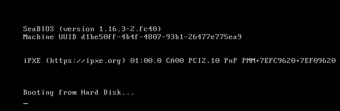
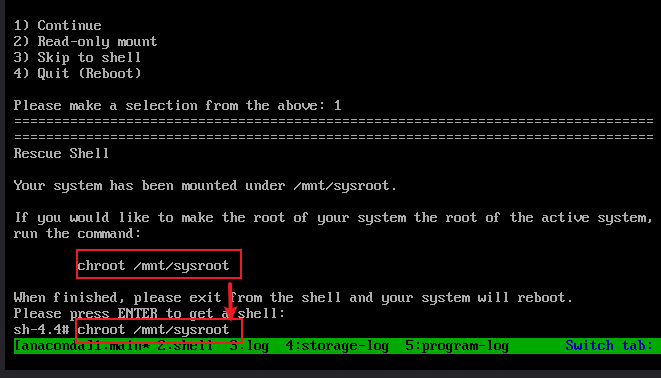
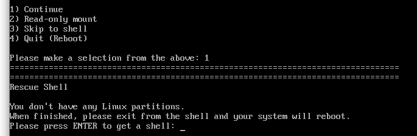

### grub丢失

#### 

由于grub的程序在第一个磁盘的前446字节,我们破坏这部分的数据,造成grub无法正常引导

```
dd if=/dev/zero of=/dev/vda bs=10 count=10
```

启动界面如下




#### 解决

使用iso启动，进行rescue模式，　1 continue,enter



```
chroot /mnt/sysroot
lsblk  #可以看到分区信息，就可有vda1, vda2的分区
grub2-install /dev/vda
exit
exit
```

去掉iso启动方式，重启解决


### 分区丢失

#### 模拟

分区信息在前510个字节.破坏这部分分区信息就会丢失

```
dd if=/dev/zero of=/dev/vda bs=10 count=49
```

进和rescue模式后，界面如下：



#### 解决

使用iso启动，进行rescue模式，　1 continue, enter

```
lsblk　＃没有分区信息，只有一个vda，没有vda1, vda2这类信息，这是第一个类问题的区别

#手工添加一个ip
nmcli c 
nmcli c m enp1s0 ipv4.address 192.168.122.181/24 ipv4.method manual
nmcli c up enp1s0

#从下面步骤中，这台机器中cp分区的配置数据,并恢复
scp root@192.168.122.180:/root/back512 .
dd if=/root/back512 of=/dev/vda bs=1 count=512

exit
```

正常启动，恢复成功


提前从另外一台相同分区的操作系统上导出前512字节的内容，这个提前准备出来，注意，分区一定要相同

```
dd if=/dev/vda of=/root/back512 bs=1 count=512
#获取ip
ip a
192.168.122.180
```


### kernel损坏

kernel损坏时，有类似以下错误

```
error: ./../qrub-core/loader/i386/pc/linux.c:178:invalid magic number
error: ../grub-core/loader/i386/pc/linux.c:421:you need to load the kernel
first

Press any key to continue.
Failed to boot both default and fallback entriesPress any key to continue...

Press any key to continue.

```

模拟

```
#找到kernel的位置，破坏
grubby --info=ALL
index=0
kernel="/boot/vmlinuz-4.18.0-553.el8_10.x86_64"

dd if=/dev/zero of=/boot/vmlinuz-4.18.0-553.el8_10.x86_64 bs=10 count=10
```


解决

1. 光盘进入修复模式

   chroot /mnt/sysroot

   

2. 从其他服务器复制/boot/vmlinuz对应版本的文件到本地/boot下覆盖  #恢复到/mnt/sysroot/boot　目录下

3. 重启

### root口令丢失


```
GRUB 菜单计时器出现时，按除 Enter 外的任意键将其暂停。
按 Ctrl+e 跳到⾏尾，删除所有 console= 设置（如果有），然后附加 rd.break

mount -o remount,rw /sysroot
chroot /sysroot
echo "root:redhat" | chpasswd
touch /.autorelabel

exit
exit
```


### 其他kernel

```
error: ../../grub-core/loader/i386/pc/linux.c:170:invalid magic number.
error: ../../grub-core/loader/i386/pc/linux.c:421:you need to load the kernel
first.
Press any key to continue...
```

此错误消息通常表⽰菜单项中没有定义内核，或者 ramdisk 在内核之前加载。

使⽤ grub 菜单启动另⼀个⼯作正常的条⽬。

```
grub2-mkconfig -o /boot/grub2/grub.cfg
grubby --info=ALL
grubby --set-default=/boot/vmlinuz-4.18.0-305.el8.x86_64
reboot
```

