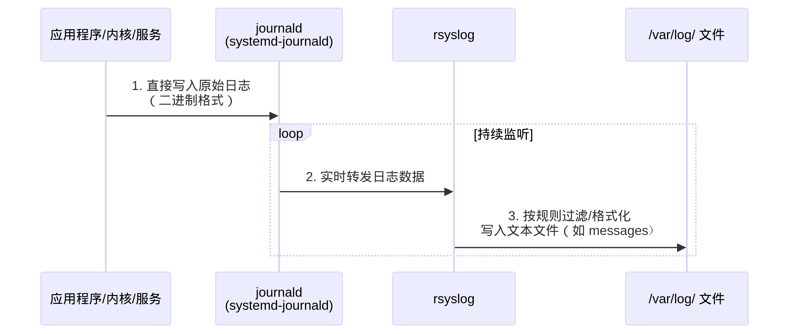

**在 RHEL 8 中，`/var/log` 目录下的多数关键日志（如 `messages`、`secure`、`cron` 等）是由 `rsyslog` 服务生成并写入的。**
但它们的**原始日志数据来源**是 `journald`（systemd-journald），`rsyslog` 扮演了**日志转发器**的角色。




前提是安装了rsyslog

```
rpm -qa|grep rsyslog
rsyslog-8.2102.0-15.el8.x86_64
```

服务已经启动

```
[root@localhost log]# systemctl list-units|grep rsyslog
rsyslog.service          
```

配置文件

```
/etc/rsyslog.conf
```


### 关键证据

#### 1. **查看 rsyslog 的 journald 输入模块**

```
# 确认 rsyslog 正在从 journald 读取数据
grep imjournal /etc/rsyslog.conf
```

输出示例：

```
module(load="imjournal" PersistStateInterval="100")  # ← 加载 journald 输入模块
```

#### 2. **查看日志转发规则**

```
grep 'action(type=' /etc/rsyslog.conf
```

输出示例：

```
# 将接收到的日志按类型写入不同文件
action(type="omfile" file="/var/log/messages")
action(type="omfile" file="/var/log/secure" )
```

#### 3. **停止 rsyslog 服务验证**

```
sudo systemctl stop rsyslog
# 此时新日志不会写入 /var/log/messages
sudo logger "Test log entry"  # 生成测试日志
tail /var/log/messages       # 不会显示该条目
journalctl -n 5              # 但 journald 中可见
```


并非所有 `/var/log` 下的文件都由 `rsyslog` 生成：

| **日志类型**     | **生成方式**             | **示例文件**                    |
| :--------------- | :----------------------- | :------------------------------ |
| **传统系统日志** | rsyslog 从 journald 转发 | `messages`, `secure`, `cron`    |
| **应用直写日志** | 应用绕过 syslog 直接写入 | `httpd/access_log`, `mysql.log` |
| **审计日志**     | auditd 服务直接生成      | `audit/audit.log`               |
| **二进制日志**   | journald 直接存储        | `journal/` 目录下的二进制文件   |
| **启动日志**     | 由 bootloader 或内核写入 | `boot.log`, `dmesg`             |


### 实践建议

#### 1. **查看日志时的选择**

- **需要结构化查询** → 用 `journalctl`

  ```
  journalctl -u nginx --since "10:00" -p err
  ```

- **快速文本搜索** → 用 `/var/log` 文件

  ```
  grep "Out of memory" /var/log/messages
  ```

#### 2. **配置注意事项**

- **禁用 rsyslog 时**：
  `/var/log/messages` 等文件**停止更新**，但 journald 仍完整记录日志。

- **日志存储优化**：

  ```
  # /etc/systemd/journald.conf
  [Journal]
  Storage=persistent    # 确保 journald 持久化存储
  SystemMaxUse=1G       # 限制磁盘占用
  ```

#### 3. **故障排查技巧**

若发现 `/var/log/messages` 无更新：

```
# 检查服务状态
systemctl status rsyslog journald

# 检查转发是否阻塞
journalctl -u rsyslog -f  # 查看 rsyslog 自身日志
```

------

### ✅ 总结

| **组件**   | **角色**                                | **存储位置**               |
| :--------- | :-------------------------------------- | :------------------------- |
| `journald` | 日志**收集器**（原始数据源）            | `/var/log/journal/`        |
| `rsyslog`  | 日志**转发器**（生成文本文件）          | `/var/log/messages` 等文件 |
| 应用程序   | 可选择直写文件或发送到 journald/rsyslog | `/var/log/` 自定义路径     |

> 📌 **简单说**：
> `/var/log/messages` 等文本日志是 `rsyslog` **加工生成的产品**，而 `journald` 是提供原材料的**供应商**。两者协作共同完成日志系统功能。